# AdminPageNurse

Administration page for Message Nurse System

## Overall system description

This web page is part of a system that includes a mobile messaging application, a MQTT broker and a backend server.


<br>

## Technologies used

The page was developed using Ionic/angular. Some libraries that were used are:
<ul>
<li>
Rsup-MQTT: simple wrapper for MQTT clients. ( https://www.npmjs.com/package/rsup-mqtt )
</li>
<li>
HighCharts: used for data visualization. (https://www.npmjs.com/package/highcharts)
</li>
</ul>

In order to launch  the webpage in debug mode, the system must be running the backend server (https://github.com/gustavobastian/ServerNurse), and then run:

```
npm install
ionic serve
```

If you want to build the site: 
```
ionic build --production
```


## Page navigation
<br>
The web page is a simple dashboard, were the administrator can monitoring the system status, add/delete/update users, add/delete/update patients, create and delete scheduled jobs, add/delete/update beds information, look at the events log , add news specialization to the treatment table and look for statistics of the system.

### Landing page

<br>
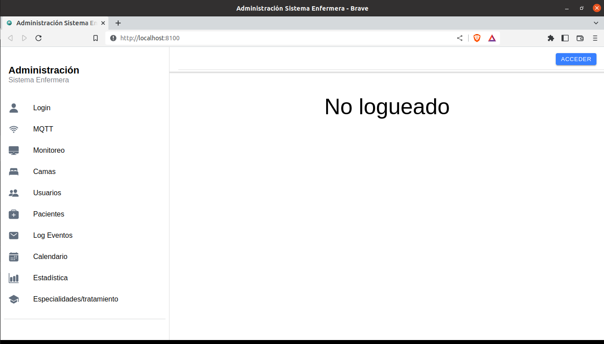
<br>

### Login page

<br>
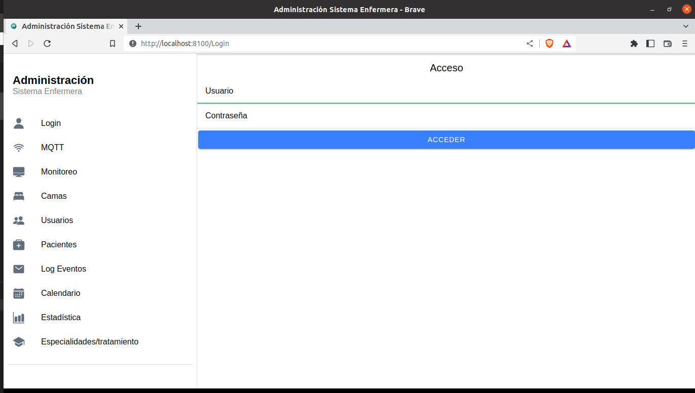
<br>

### MQTT config page

<br>
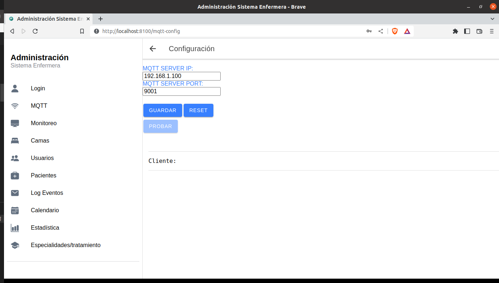
<br>

### Event logs  page

<br>
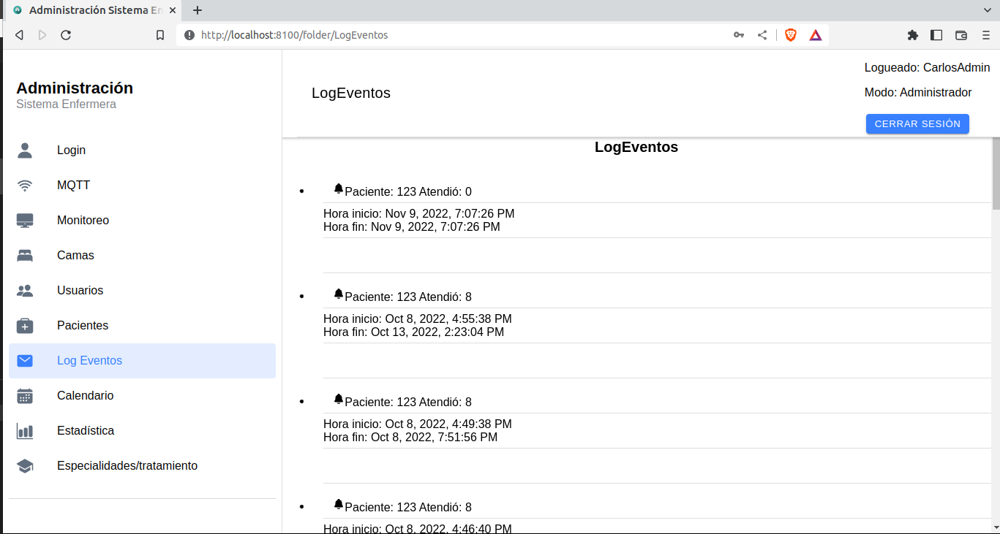
<br>


### Monitoring page

In this page the administrator can view the current status of the beds or the users.

<br>
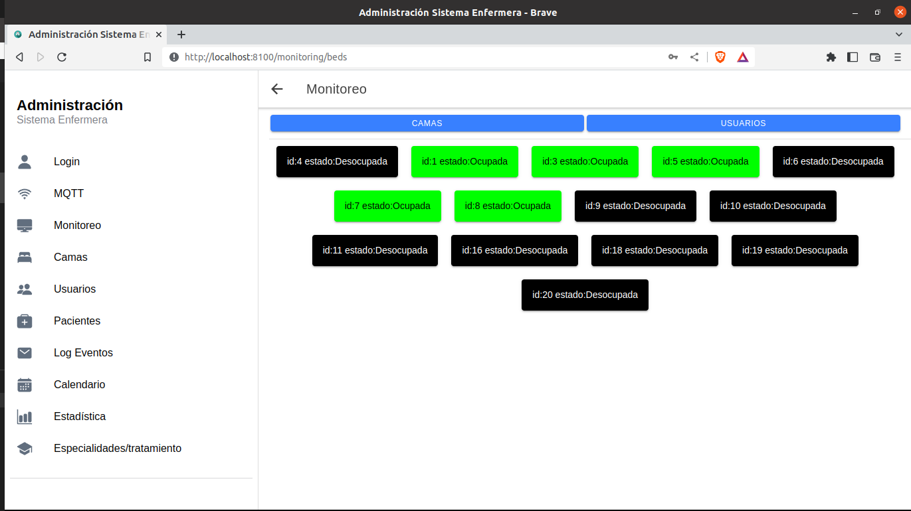
<br>

<br>
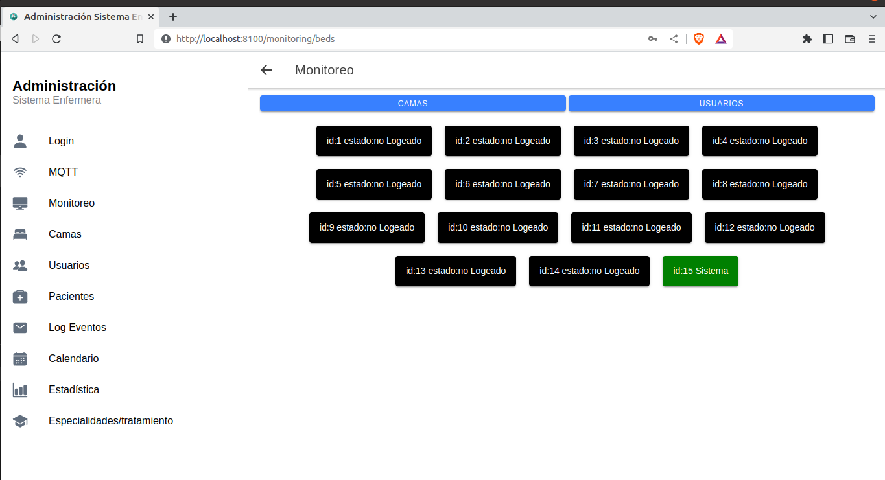
<br>

### Nurse specializations page

In this page the administrator can store a new specialization in the database.

<br>

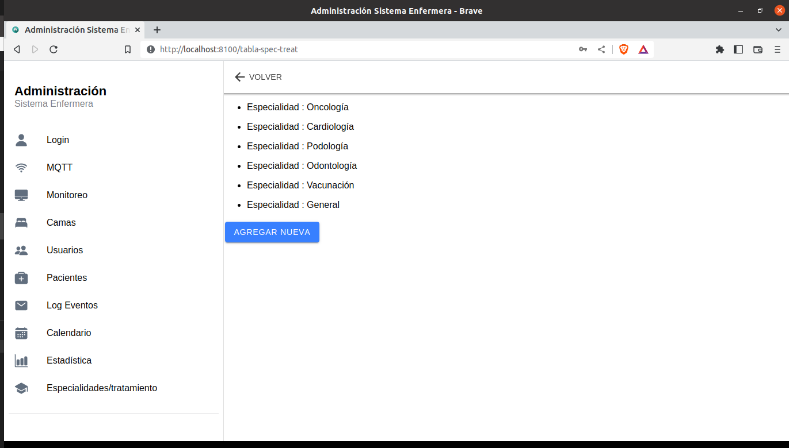

<br>


### Users editing page

In this page, the administrator can create, update or delete users.

<br>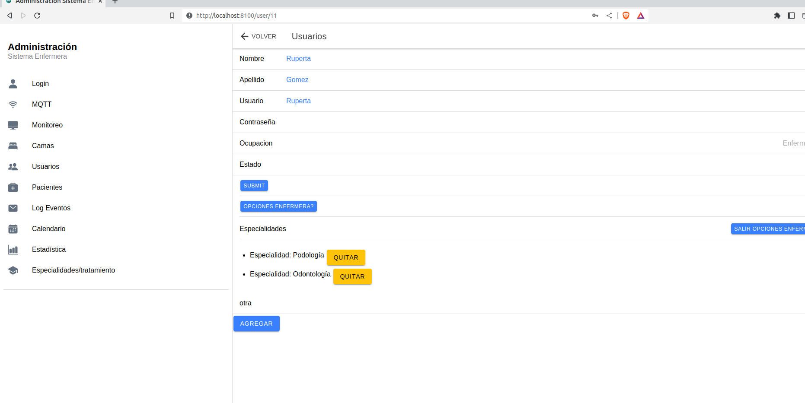

<br>

### Patients editing page

In this page, the administrator can create, update or delete users.

<br>

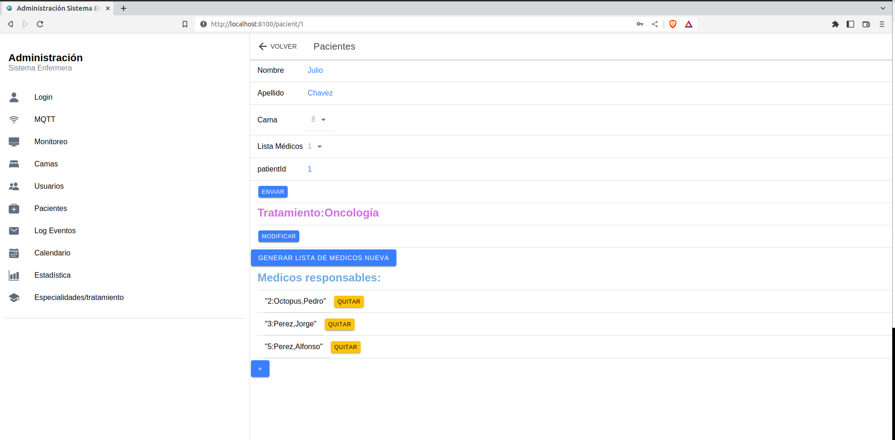

<br>

### Scheduling a task page

In this page, the administrator can create or delete task for a patient. The tasks could be daily, weekly or montly. They will be stored in the backend database.

<br>

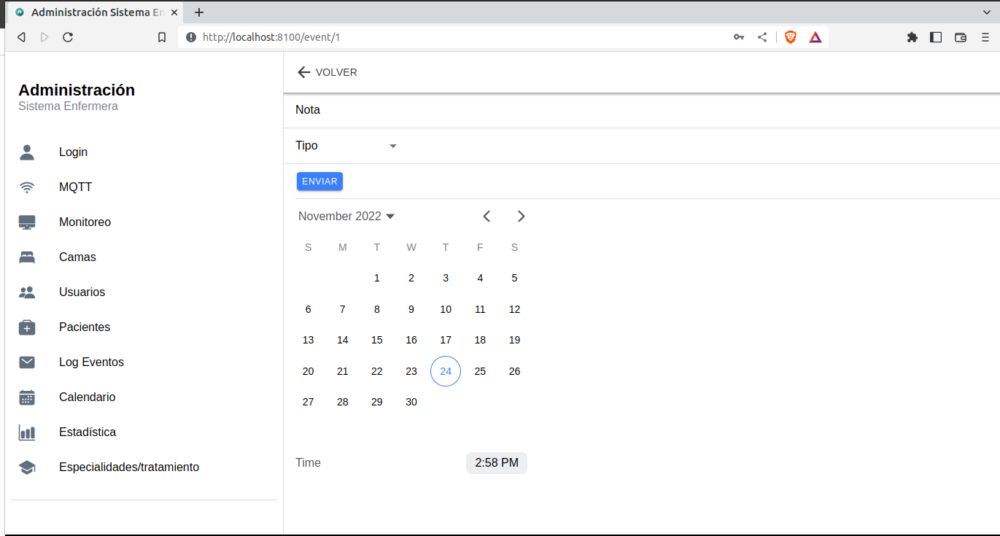

<br>

### Nurse and patients statistics page

<br>
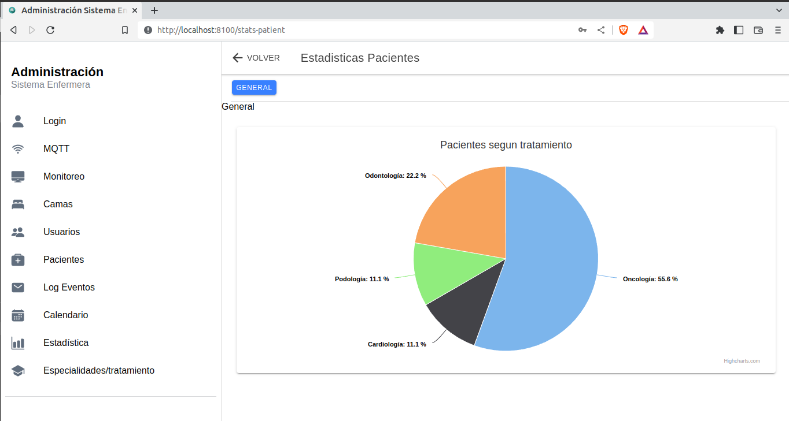
<br>


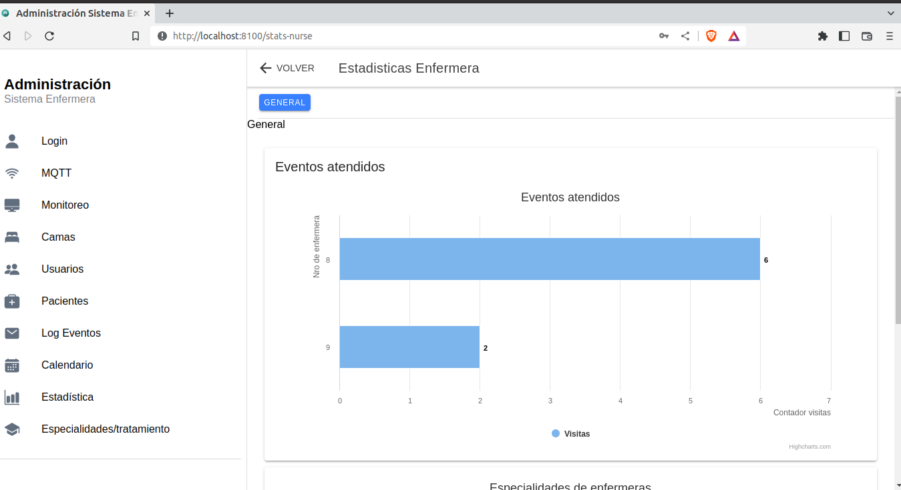

<br>

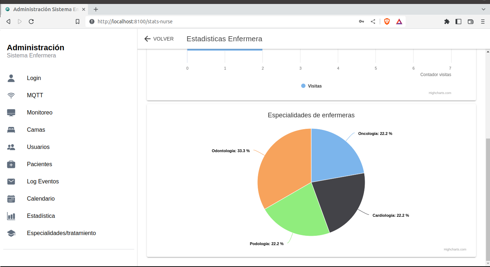

<br>
